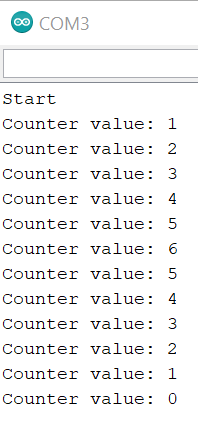

# Lab 2
## Make A Digital Timer!
### Part A. Solder Your OLED
Code can be found [here](./code/display_a0/display_a0.ino)\.  
### Part B. Make a Lowly Multimeter
Code can be found [here](./code/multimeter/multimeter.ino)\.  
Video of operation can be found [here](./media/multimeter.mp4)\.  
### Part C. Using a Time-Based Digital Sensor
I made the encoder output display on the OLED, but doing so seems to have slowed
the program enough that it sometimes misses or misreads encoder movements.
This could be fixed by using some sort of interrupt to handle encoder movements.  
My code can be found [here](./code/encoder/encoder.ino)\.  
Here is a picture of the serial output.  

### Part D. Make Your Arduino Sing!
a. To double the playback rate, you would make noteDuration = 500/noteDurations[thisNote].  
b. It is playing the Star Wars theme.

### Part E. Make Your Own Timer
My timer allows you to adjust the time with the rotary encoder. You can start
the timer by pressing down on the encoder's pushbutton. The OLED will display a
MM:SS countdown, and, when it reaches 00:00, the speaker will buzz until you
press the pushbutton again.  
Code can be found [here](./code/timer/timer.ino)\.  
Video of operation can be found [here](./media/timer.mp4)\.
