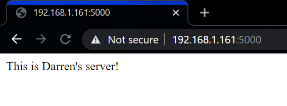

## Serving webpages with the Raspberry Pi

**Customize the code enough that the webpage served up is clearly your own, and include a screenshot and any modified code in the lab folder.**



My code can be found [here](./code/darrenserver.py).

### Flash the HelloYou Sketch onto the Arduino

**What messages are sent from the Arduino to the Pi?**  
The Arduino writes the current state of the button ('light' or 'dark') over serial.

**What messages are expected from the Pi to the Arduino?**  
The Pi writes 'H' or 'L' over serial whenever an input comes to the server.

**What happens if the Pi sends an unexpected message to the Arduino?**  
The LED is turned off. This is because the Arduino code uses an if else statement, so all inputs that don't satisfy the if condition will fall through to the else.

**How fast does the Arduino communicate with the Pi? What would you change to make it send messages less often?**  
It communicates at 9600 baud. The Arduino only sends messages when the button state changes. So, to send messages less often, press the button more slowly. To send messages more slowly, lower the baud rate.

### Run the HelloYou server on the RPi

**What messages are sent from the Pi to the Arduino?**  
The Pi writes 'H' or 'L' over serial whenever an input comes to the server.

**What messages are expected from the Arduino to the Pi?**  
The Arduino writes the current state of the button ('light' or 'dark') over serial.


**What happens if the Arduino sends an unexpected message to the Pi?**  
Nothing happens. This is because the js explicitly checks for both expected messages in a switch statement, so an unexpected value simply falls through without executing any code.

**What messages are sent to the console? When?**  
"ledOn" and "ledOff" are printed when the led is toggled

## Internet of Cornell Tech Things

Technical specification:
```
MQTT_boker: mqtt.eclipse.org
Topic: ixe
Acceptable messages (string): 'red' || 'green' || 'blue' (more to be added later)
Webcam: http://farlab.infosci.cornell.edu:8081
```

## Video doorbell
**Please include video of the project**  
My video can be found [here](./media/color_cycle.mp4)\.

**All supporting designs materials and code should be in your lab assignment folder, and documented enough that you could recreate it from scratch if you had memory loss.**  
The code for this project is in [this directory](./code/video_server/)\.

The Raspberry Pi runs a server that livestreams the camera footage. It also monitors the MQTT channel and, when one of the expected inputs comes in, it notifies the Arduino via serial.  

A separate Raspberry Pi program cycles through sending the different expected messages to the MQTT server.

The Arduino listens for a serial message from the Raspberry Pi and sets its output accordingly.
