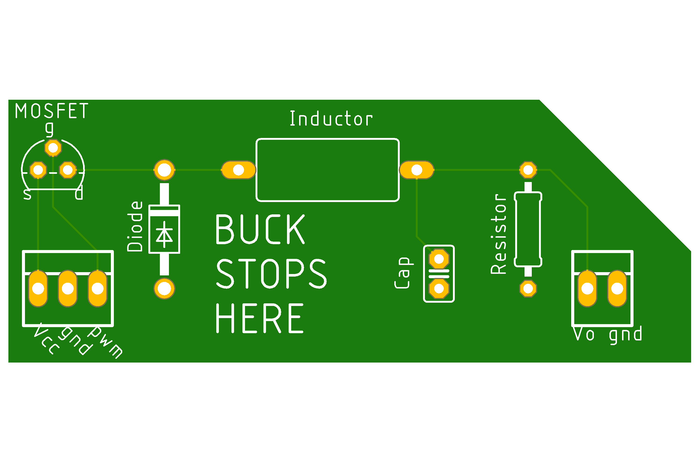

# Alt Lab 2
## Part A. Design your Arduino+

**a) What is the + improvement of your Arduino+**  
I have implemented a buck converter -- a simple, pwm-controlled DC step-down converter -- which allows the analogOut() function to be used to output actual analog voltages.

**b) What Arduino form-factor/design are you basing your design off of?**  
I have implemented my design as a daughter card that can hooked up to any pwm, so it is compatible with any Arduino form factor.

**c) What features/parts need to be incorporated for your Arduino+? Include your research!**  
The buck converter is basically a charge pump and lowpass filter. It is constructed entirely of basic circuit components (transistor, capacitor, inductor, diode)

**d) What is the timeline for the overall development of your Arduino?**  
The PCB has been ordered and should arrive within a couple of weeks.

**e) Which fabrication company are you using, what do you plan to order, and what is the design rationale for the selection?**  
I am using OSH Park. I ordered a set of PCBs from them. I did not order components or assembly, as I already have the components here and the assembly will be simple.

## Part B. Order parts for your Arduino+

I already own enough generic electronics components to complete this board. I have listed the models that I will be using, selected largely based on what I have on-hand, in the table below.

| Part     | Model | Quantity |
|----------|-------|----------|
|MOSFET    |BS170  |1         |
|Diode     |1N4007 |1         |
|Inductor  |Generic|1         |
|Resistor  |Generic|1         |
|Pin Header|Generic|5         |

## Part C. Prototype your Arduino+

**Describe key design questions (how big are the parts? what pins need to be connected?) and how you used/will use prototyping to answer them.**  
The values for the capacitor, inductor, and resistor must be selected. This can be achieved through simulation and experimentation on a breadboard.

## Part D. Layout your Arduino+

**Document what you files, with enough specificity that anyone else could have the same thing made.**  
I have created design files with Eagle. The preview image of the board is shown here.  

## Part E. Send your board off to be made
**Document what you sent, and to where, with enough specificity that anyone else could have the same thing made.**  
I ordered the board (design files included in this repo) from OSH Park.

**In the report, please tell us any pain points you faced in this lab, and how we could make this process easier for future students.**  
I believe that having students design a separate board like I did, rather than modify an existing Arduino design, would be a much more approachable and helpful introduction to PCB design.
