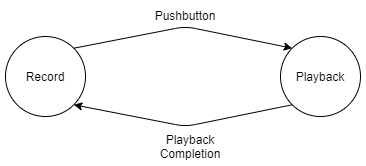

## Part A.  Writing to the Serial Monitor

**a. Based on the readings from the serial monitor, what is the range of the analog values being read?**  

0-1023

**b. How many bits of resolution does the analog to digital converter (ADC) on the Arduino have**  
10 bits

## Part B. RGB LED

My code can be found [here](./code/rgb_led_fun/rgb_led_fun.ino)

A video can be found [here](./media/rgb_led.mp4)

## Part C. Resistance & Voltage Varying Sensors

### FSR

**a. What voltage values do you see from your force sensor?**  
0 - 997  
0 - ~4.87v

**b. What kind of relationship does the voltage have as a function of the force applied? (e.g., linear?)**  
Nonlinear  

**c. In `Examples->Basic->Fading` the RGB LED values range from 0-255. What do you have to do so that you get the full range of output voltages from the RGB LED when using your FSR to change the LED color?**  
One solution would be to scale the full range of FSR outputs to the range of LED values. Another would simply be to use a modulo operator to bound the output range.

## Flex Sensor and Photo cell  
I could not find the softpot in my kit. Other students had the same issue.  

**a. What resistance do you need to have in series to get a reasonable range of voltages from each sensor?**  
Flex: A 10kOhm resistor worked _okay_. A 47k would likely have worked better, but I did not have one on hand to try. Unfortunately, this sensor does not have an extremely wide range of resistance ~(20k-100k), so getting a wide range of voltages from it is a bit difficult. This could be remedied with an amplifier circuit.  

Photo Cell: A 4.7kOhm resistor gave a decent voltage range. This makes sense, as it falls roughly in the middle of the ~(1k-10k) resistance range of the sensor.

**b. What kind of relationship does the resistance have as a function of stimulus? (e.g., linear?)**

It is very difficult to tell what a linear input is for these sensors (radius of bend? lumens exposed?), but the relationship between input and output voltage is almost certainly nonlinear, as they rely on the same voltage-divider topology as the force sensor.

## Part D. I2C Sensors

### Accelerometer

**a. Include your accelerometer read-out code in your write-up.**

My code can be found [here](./code/accel_oled/accel_oled.ino)\.  
A video can be found [here](./media/accel_oled.mp4)\.

## Part E. Logging values to the EEPROM and reading them back

### 1. Reading and writing values to the Arduino EEPROM
The sample code in `File->Examples->EEPROM` shows functions from the [Arduino EEPROM Library](https://www.arduino.cc/en/Reference/EEPROM) to write and read values to Arduino's EEPROM. This [modified version of the SwitchState code](https://github.com/FAR-Lab/Interactive-Lab-Hub/tree/master/Lab4/SwitchState) employs these functions in three different states. Try it out.

**a. Does it matter what actions are assigned to which state? Why?**  
Clearly, it would affect behavior. In this specific example, the code clears data when the input is low, writes data when the input is high, and reads when the input is intermediate.

Switching these up could cause issues, for example, if the clear state was placed in the middle. Then, because the potentiometer cannot immediately change values, it would be impossible to ever read out the data that was written, as clear would always happen between them.

**b. Why is the code here all in the setup() functions and not in the loop() functions?**  
Each state executes only once before returning to the SwitchState code.

Each character in the string is a byte. That is, it takes 8-bits to encode a character, so the number of characters in the string we are writing is the number of bytes we are occupying in EEPROM. The [Atmega 328P](https://www.microchip.com/wwwproducts/en/atmega328p) at the heart of the Arduino has 1024 bytes of internal [EEPROM](http://en.wikipedia.org/wiki/EEPROM) Memory (which is separate from the 32KB of [Program memory](https://en.wikipedia.org/wiki/Read-only_memory) it has for the code it is running.)

**c. How many byte-sized data samples can you store on the Atmega328?**  
1024 samples  

**d. How would you get analog data from the Arduino analog pins to be byte-sized? How about analog data from the I2C devices?**  
Limit or scale it to an 8-bit range (0-255) and cast to a byte.

**e. Alternately, how would we store the data if it were bigger than a byte? (hint: take a look at the [EEPROMPut](https://www.arduino.cc/en/Reference/EEPROMPut) example)**
Store it across consecutive memory addresses or scale it down to a byte.

### 2. Design your logger  
My data logger will constantly record input voltage at regular increments, overwriting past measurements as required. When a pushbutton is activated, the recorded data will be displayed by varying the brightness of an LED over time.

**a. Turn in a copy of your final state diagram.**

## Part G. Create your own data logger!

**a. Record and upload a short demo video of your logger in action.**

My code can be found [here](./code/data_logger/data_logger.ino)\.

A video can be found [here](./media/data_logger.mp4)\.

# Lab5

# Integrated Interactive Device

***

For this week’s lab, you will design and build an autonomous device that incorporates:

* Physical Fabrication
* Actuation
* Sensing/Input
* Timing
* Sound

As a guide, we have included instructions to get you most of the way through designing a Jack-in-a-Box. Feel free to explore alternatives to the basic design. For example, if you turn the box on its side, you could have a mouse trap, or a cat door.

## In the report
Show photos and a video of your final design in action.

Include your sketches and designs for your device, including for ideas you didn't pursue this time.

## Basic Cardboard Box construction

Building off of the strip box from [Lab 3](https://github.com/FAR-Lab/Developing-and-Designing-Interactive-Devices/wiki/Lab-03), this box design is built from two cardboard strips that are the same width X.

This design can be made by scoring two long strips of corrugated cardboard of width X, with the following measurements:

| <---- X ---->   + thickness of cardboard | <---- X ----> |
| --- | --- | --- |

| <---- X ----> | <---- X ----> | <---- X ----> | <---- X ----> |
| --- | --- | --- | --- |

Use an Olfa knife with a cutting mat to cut out your pattern, using 2 cuts to score the cardboard strip at the bends and 3 cuts to cut. (A second mat can be used as a straight edge, and you can use one strip to measure out X on the other.)

Fold the flaps up, and cut the as necessary to level the sides.

Hot glue the two pieces in a 't', with the 3-segment strip on the bottom. You have a few seconds, while the glue is hot, to make sure the pieces are lined up correctly before the glue cools and sets.  The weight of the double cardboard bottom helps to make the box stable.

On the side flap where you plan to mount the servo motor, use a bead of hot glue along the edge to join the flaps together. Hold the flaps for a few seconds until the hot glue sets.

DO NOT GLUE THE OTHER SIDE FLAP.

## Make a cardboard servo motor mount

The cardboard mount holds the servo motor against the side of the box.

This can be made with strip of cardboard scrap of width X, where X > the height of the servo motor

| F length of flap | D  = depth of servo to the flange | W width of the servo  + two cardboard thicknesses | D  = depth of servo to the flange | F length of flap|
| --- | --- | --- | --- | --- |

Cut a square hole in the middle of the strip for the rectangular face of the servo to fit through.

Hot glue the flaps and the back of the servo and stick this in the back corner of the box, with the pivot of the servo near the lid. As before, you will need to hold things in place for a bit while the hot glue sets.

** include a photo of your box and servo mount **

## Make the service panel for your box.

Check to make sure your breadboard and battery fit in. To make programming easier, orient things so the USB cable faces the open side of the box.

Use shipping tape to make slick patches on the sides of the box, and use removable blue tape (with the ends folded under to make grab tabs) to make a reclosable service panel for your box.

** include a photo of your box closed  **

## Electronics

Tip: If you don't have the 9V connector, you just need to make sure that the micro controller is plugged into your computer, for power.

### Program your device

Load the [example](https://github.com/FAR-Lab/Developing-and-Designing-Interactive-Devices/blob/2019Fall/Lab5/JackInABox.ino) previously downloaded.

You can also make your own program but make sure you put HIGH digital value to pin 5 if you connected the circuit as the one in the electronics part.

Pay attention that you can change the position of close and open box in the following lines:

#define closePos  10

#define openPos   110

## Make your box open using the servo motor

You'll have to hot glue an arm to the servo motor arm to push back the lid. How should that arm be designed?

** include a photo of your arm design  **

## Putting it all together
***
Think about where each component should go, and assemble your box so that the servo motor opens the box.

** include a video of the box opening  **

## Create Jack

Using cardboard, paper, or found objects, make a jack that pops out when the top opens.

Here are useful links:

[How to make a paper spring](https://bookzoompa.wordpress.com/2010/03/14/how-to-make-a-paper-spring/)
[How to Use Slicer to make 3D shapes using stacked slices of laser (or Olfa) -cut cardboard](https://core-electronics.com.au/tutorials/using-slicer-for-fusion360-for-laser-cutting-tutorial.html)

** include drawings, sketches or links to any part files used for creating Jack   **

** include a video of the finished design   **

## Lab Submission
***
For your write up, include:
1.	Your Arduino code.
2.	.stl or .svg files for your Jack — if you use some other technique, include the respective supporting material.
3.	At least one photo-studio-quality photo of your box closed, and another photo of your box open.

4.	A video of your box in action.
