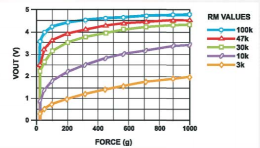

## Part A.  Writing to the Serial Monitor

**a. Based on the readings from the serial monitor, what is the range of the analog values being read?**  

0-1023

**b. How many bits of resolution does the analog to digital converter (ADC) on the Arduino have**  
10 bits

## Part B. RGB LED

My code can be found [here](./code/rgb_led_fun/rgb_led_fun.ino)

A video can be found [here](./media/rgb_led.mp4)

## Part C. Resistance & Voltage Varying Sensors

### FSR

**a. What voltage values do you see from your force sensor?**  
0 - 997  
0 - ~4.87v

**b. What kind of relationship does the voltage have as a function of the force applied? (e.g., linear?)**  
Nonlinear  

**c. In `Examples->Basic->Fading` the RGB LED values range from 0-255. What do you have to do so that you get the full range of output voltages from the RGB LED when using your FSR to change the LED color?**  
One solution would be to scale the full range of FSR outputs to the range of LED values. Another would simply be to use a modulo operator to bound the output range.

## Flex Sensor and Photo cell  
I could not find the softpot in my kit. Other students had the same issue.  

**a. What resistance do you need to have in series to get a reasonable range of voltages from each sensor?**  
Flex: A 10kOhm resistor worked _okay_. A 47k would likely have worked better, but I did not have one on hand to try. Unfortunately, this sensor does not have an extremely wide range of resistance ~(20k-100k), so getting a wide range of voltages from it is a bit difficult. This could be remedied with an amplifier circuit.  

Photo Cell: A 4.7kOhm resistor gave a decent voltage range. This makes sense, as it falls roughly in the middle of the ~(1k-10k) resistance range of the sensor.

**b. What kind of relationship does the resistance have as a function of stimulus? (e.g., linear?)**

It is very difficult to tell what a linear input is for these sensors (radius of bend? lumens exposed?), but the relationship between input and output voltage is almost certainly nonlinear, as they rely on the same voltage-divider topology as the force sensor.

## Part D. I2C Sensors

### Accelerometer

**a. Include your accelerometer read-out code in your write-up.**

My code can be found [here](./code/accel_oled/accel_oled.ino)\.  
A video can be found [here](./media/accel_oled.mp4)\.

## Part E. Logging values to the EEPROM and reading them back

### 1. Reading and writing values to the Arduino EEPROM
The sample code in `File->Examples->EEPROM` shows functions from the [Arduino EEPROM Library](https://www.arduino.cc/en/Reference/EEPROM) to write and read values to Arduino's EEPROM. This [modified version of the SwitchState code](https://github.com/FAR-Lab/Interactive-Lab-Hub/tree/master/Lab4/SwitchState) employs these functions in three different states. Try it out.

**a. Does it matter what actions are assigned to which state? Why?**  
Clearly, it would affect behavior. In this specific example, the code clears data when the input is low, writes data when the input is high, and reads when the input is intermediate.

Switching these up could cause issues, for example, if the clear state was placed in the middle. Then, because the potentiometer cannot immediately change values, it would be impossible to ever read out the data that was written, as clear would always happen between them.

**b. Why is the code here all in the setup() functions and not in the loop() functions?**  
Each state executes only once before returning to the SwitchState code.

Each character in the string is a byte. That is, it takes 8-bits to encode a character, so the number of characters in the string we are writing is the number of bytes we are occupying in EEPROM. The [Atmega 328P](https://www.microchip.com/wwwproducts/en/atmega328p) at the heart of the Arduino has 1024 bytes of internal [EEPROM](http://en.wikipedia.org/wiki/EEPROM) Memory (which is separate from the 32KB of [Program memory](https://en.wikipedia.org/wiki/Read-only_memory) it has for the code it is running.)

**c. How many byte-sized data samples can you store on the Atmega328?**  
1024 samples  

**d. How would you get analog data from the Arduino analog pins to be byte-sized? How about analog data from the I2C devices?**  
Limit or scale it to an 8-bit range (0-255) and cast to a byte.

**e. Alternately, how would we store the data if it were bigger than a byte? (hint: take a look at the [EEPROMPut](https://www.arduino.cc/en/Reference/EEPROMPut) example)**
Store it across consecutive memory addresses or scale it down to a byte.

### 2. Design your logger  
My data logger will constantly record input voltage at regular increments, overwriting past measurements as required. When a pushbutton is activated, the recorded data will be displayed by varying the brightness of an LED over time.

**a. Turn in a copy of your final state diagram.**

## Part G. Create your own data logger!

**a. Record and upload a short demo video of your logger in action.**

My code can be found [here](./code/data_logger/data_logger.ino)\.

A video can be found [here](./media/data_logger.mp4)\.

# Lab5

# Integrated Interactive Device  
My code can be found [here](./code/jack_box/jack_box.ino)\.  
A video can be found [here](./media/jack_box.mp4)\.

## Closed Box

## Open Box  

## Access Port

## Servo Mount

